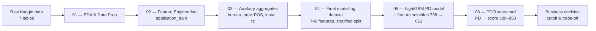
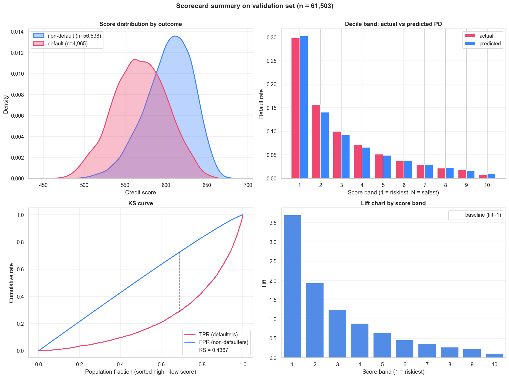
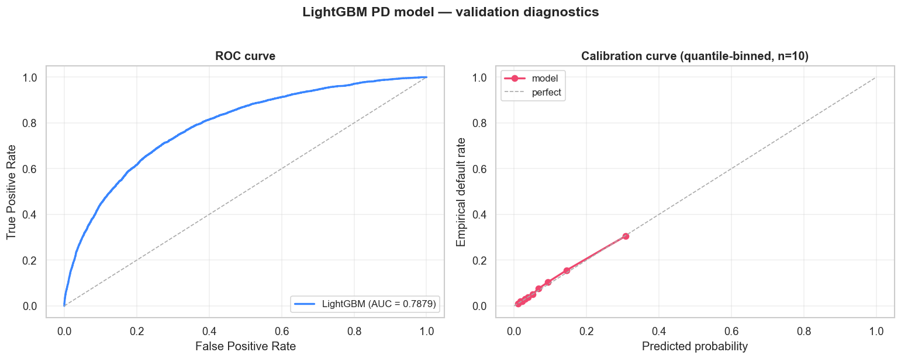

# Credit Risk Scoring — End-to-End PD Model & Scorecard


Production-style probability-of-default (PD) model and FICO-style scorecard built on the [Home Credit Default Risk](https://www.kaggle.com/competitions/home-credit-default-risk) dataset. The pipeline goes from raw application data to a business-ready credit decision (approve / reject) backed by a calibrated 300–850 score.

---

## Project Overview

Banks need to estimate the probability that a loan applicant will default. This project implements the full pipeline a credit-risk team would actually ship:

1. **Engineer features** from seven raw tables (application, bureau, previous applications, POS-cash, installments, credit-card balance) into a single modelling frame.
2. **Train** a gradient-boosted classifier (LightGBM) and tune it via importance-based feature selection.
3. **Convert** raw probabilities into a transparent, regulator-friendly **PDO scorecard** (300–850).
4. **Decide** on a cutoff using KS analysis and a business trade-off table (approval vs. expected loss vs. capture rate).

All logic lives in pure, testable Python modules under `src/`; notebooks orchestrate the pipeline and present results.

---

## Key Results

Validation set: 61,503 customers, base default rate 8.07%.

### LightGBM PD model

| Metric | Train  | Valid  |
|--------|--------|--------|
| AUC    | 0.9190 | **0.7879** |
| Gini   | 0.8380 | **0.5757** |
| KS     | 0.7100 | **0.4365** |
| LogLoss| 0.1559 | 0.2368 |
| Brier  | 0.0436 | 0.0658 |

Feature selection reduced the model from 738 to **612 features** while preserving validation AUC and **shrinking the train–valid AUC gap by ~23 %** (0.17 → 0.13).

### PDO Scorecard

| Parameter   | Value | Interpretation                          |
|-------------|-------|------------------------------------------|
| PDO         | 20    | every +20 points halves the odds of default |
| base_score  | 600   | anchor: 600 points = 5% PD               |
| score range | 462 – 684 | observed on validation; no clipping  |

### Business decision (cutoff = 587, KS-optimal)

| Cutoff | Approval | Default rate (approved) | Capture rate (rejected) |
|--------|----------|--------------------------|--------------------------|
| 575    | 80.0 %   | 4.34 %                   | 57.0 %                   |
| **587 (chosen)** | **69.7 %** | **3.44 %** | **70.3 %**       |
| 600    | 55.3 %   | 2.60 %                   | 82.2 %                   |
| 625    | 23.7 %   | 1.40 %                   | 95.9 %                   |

The selected cutoff catches **70 %** of true defaulters while still approving **70 %** of applicants — a balance an originations team can defend.

---

## Architecture



---

## Visualizations

### Scorecard summary



- **Top-left:** validation score density splits cleanly between defaults (red) and non-defaults (blue).
- **Top-right:** decile bands — predicted PD (blue) tracks the actual default rate (red) within ~1.5 % at every band; the model is well calibrated out-of-the-box.
- **Bottom-left:** KS curve peaks at 0.437 around the 587-point cutoff.
- **Bottom-right:** lift in the riskiest decile is **3.7×** the baseline default rate; the safest decile drops to 0.1×.

### Model diagnostics



ROC area = 0.788 on validation; the calibration curve sits on the diagonal across the full probability range, so the raw `predict_proba` can be interpreted directly as a PD without post-hoc isotonic / Platt scaling.

---

## Project Structure

```text
Credit_Risk_Project/
├── notebooks/
│   ├── 01_EDA_and_Data_Prep.ipynb        # missingness, target leakage checks, target ratio
│   ├── 02_Feature_Engineering.ipynb       # ratios, polynomial bins on application_train
│   ├── 03_Feature_Engineering_Auxiliary.ipynb  # bureau / prev / POS / installments / cc aggregates
│   ├── 04_Final_Dataset.ipynb             # join, stratified split, parquet export
│   ├── 05_Modeling_LightGBM.ipynb         # train + feature selection + diagnostics
│   └── 06_Scorecard.ipynb                 # PDO transform + cutoff analysis
├── src/
│   ├── utils.py                           # paths, logging helpers
│   ├── feature_engineering.py             # pure aggregation functions per source table
│   ├── modeling.py                        # LightGBM training, evaluation, feature selection
│   └── scorecard.py                       # PDO math, KS / lift / cutoff utilities
├── scripts/
│   └── generate_readme_assets.py          # rebuild the figures shown above
├── data/                                   # gitignored (raw + processed parquet)
├── assets/readme/                          # static figures used in this README
├── requirements.txt
├── .pre-commit-config.yaml                # nbstripout: keeps notebooks output-free in git
└── README.md
```

Generated artifacts (in `data/processed/`, gitignored):
- `lgbm_pd_model.txt`, `lgbm_selected_features.json`, `lgbm_feature_importance.parquet`
- `valid_predictions.parquet`, `valid_scores.parquet`
- `scorecard_params.json`, `score_bands.parquet`, `cutoff_analysis.parquet`

---

## Methodology Highlights

- **Aggregation pipeline (`src/feature_engineering.py`):** per-source-table aggregators emit consistent prefixes (`BURO_`, `PREV_`, `INSTAL_`, `POS_`, `CC_`) so feature provenance stays readable in importance plots.
- **Stratified split:** 80/20 on `TARGET` to preserve the 8.07 % default rate in both folds (the dataset is imbalanced).
- **No `class_weight` / `scale_pos_weight`:** keeping raw probability semantics simplifies calibration and downstream score interpretation.
- **Feature selection by gain:** dropping the 126 features LightGBM never split on cut the train–valid AUC gap from 0.17 to 0.13 with no loss in validation AUC. Going further (top-200) hurt performance — the long tail of medium-importance features carries real signal.
- **PDO scorecard:** `score = offset + factor · log((1 − p) / p)` with `factor = PDO / log 2`. Anchored at 600 = 5 % PD so each ±20 points doubles or halves the odds, matching how lenders communicate risk internally.

---

## How to Run

### Prerequisites

- Python 3.11
- Kaggle account (to download the dataset)

### Setup

```bash
# 1. Clone and enter the repo
git clone https://github.com/dogukaneroglu/Credit_Risk_Project.git
cd Credit_Risk_Project

# 2. Create a virtual environment
python -m venv .venv
.venv\Scripts\activate          # Windows
# source .venv/bin/activate     # macOS / Linux

# 3. Install dependencies
pip install -r requirements.txt

# 4. (Optional) install pre-commit hooks
pre-commit install
```

### Data

Download the Home Credit Default Risk dataset from Kaggle and unzip it into `data/raw/` (the path is gitignored):

```bash
kaggle competitions download -c home-credit-default-risk -p data/raw
unzip data/raw/home-credit-default-risk.zip -d data/raw
```

### Run the pipeline

Execute the notebooks in order — each one writes the parquet files the next one needs:

```text
notebooks/01_EDA_and_Data_Prep.ipynb
notebooks/02_Feature_Engineering.ipynb
notebooks/03_Feature_Engineering_Auxiliary.ipynb
notebooks/04_Final_Dataset.ipynb
notebooks/05_Modeling_LightGBM.ipynb
notebooks/06_Scorecard.ipynb
```

Notebook 05 takes ~10 minutes on a CPU; everything else runs in seconds to a few minutes. To regenerate the README figures after a fresh run:

```bash
python scripts/generate_readme_assets.py
```

---

## Technical Stack

- **Python 3.11**, `pandas`, `numpy`
- **LightGBM 4** for the gradient-boosted PD model
- **scikit-learn** for split / metrics / calibration utilities
- **matplotlib**, **seaborn** for visualization
- **PyArrow** / Parquet for efficient intermediate storage
- **Jupyter**, **nbstripout** + **pre-commit** for clean notebook diffs in git

---

## Author

**Doğukan Eroğlu**

- Mathematical Engineering, Yıldız Technical University
- LinkedIn: [doğukan-eroğlu](https://www.linkedin.com/in/do%C4%9Fukan-ero%C4%9Flu-2762091b2/)
- GitHub: [@dogukaneroglu](https://github.com/dogukaneroglu)
